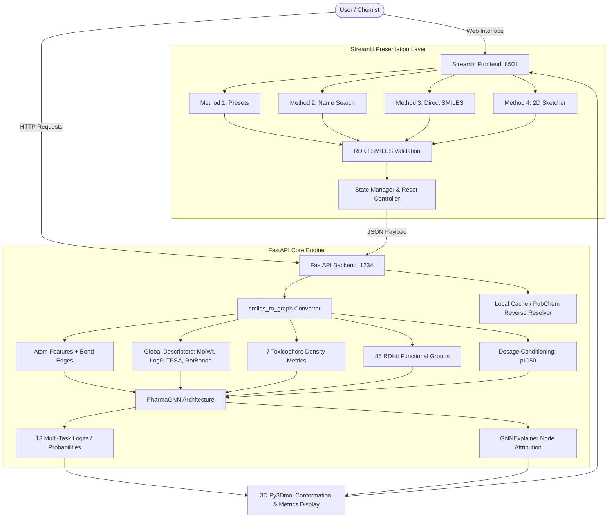

# PharmaGraph: AI Pharmacological Properties and Toxicity Prediction

[](https://www.python.org/)
[](https://fastapi.tiangolo.com/)
[](https://streamlit.io/)
[](https://pyg.org/)
[](https://www.rdkit.org/)
[](LICENSE)

**PharmaGraph** is an end-to-end deep learning platform designed for computational chemistry, toxicology, and drug discovery. It predicts compound pharmacological properties and biological toxicity risks using **Graph Attention Networks (GATv2)** enhanced with **Functional Group Cross-Attention**, **Knowledge-Based Toxicophore Alert Densities**, and **Concentration/Dosage Awareness**.

---

## 📑 Table of Contents

- [Key Capabilities](#key-capabilities)
- [System Architecture](#system-architecture)
- [Model Details](#model-details)
- [Installation & Environment Setup](#installation--environment-setup)
- [Running the Application](#running-the-application)
  - [Local Development Mode](#1-local-development-mode)
  - [Docker & Docker Compose](#2-docker--docker-compose)
- [Web Dashboard Guide](#web-dashboard-guide)
- [REST API Reference](#rest-api-reference)
- [Model Training & Dataset Pipeline](#model-training--dataset-pipeline)
- [Project Structure](#project-structure)
- [License](#license)

---

## 🌟 Key Capabilities

1. **Multi-Task Pharmacological Profiling**:
   Jointly predicts 13 biological assay endpoints, including 12 nuclear receptor (NR) and stress response (SR) pathways from the NIH Tox21 initiative, alongside clinical toxicity (`CT_TOX`) from the ClinTox benchmark.
2. **Concentration & Dosage Conditioning**:
   Toxicity is fundamentally dose-dependent. PharmaGraph accepts compound dosage inputs (Molar concentration) and projects it into a normalized affinity space ($pIC_{50} = -\log_{10}(\text{Molar})$) to condition predictions dynamically.
3. **Functional Group Cross-Attention Mechanism**:
   Extracts 85 chemical functional group fragment counts via RDKit and processes them through multi-head self-attention to capture non-linear group synergies and reactive chemical interactions.
4. **Knowledge-Driven Toxicophore Densities**:
   Encodes structural alert densities for recognized toxicophores (Cyanides, Organophosphates, Benzene rings, Phenols, Aldehydes, Sulfides, and Halogenated aromatics).
5. **Explainable AI (XAI) with 3D Visualization**:
   Integrates **GNNExplainer** to assign importance scores to individual atoms. Identified toxicophores are mapped onto interactive 3D conformations (`py3Dmol`), highlighting high-risk regions in red.
6. **Flexible Input Modalities**:
   Supports four distinct, exclusive input methods:
   - Curated reference presets (Aspirin, Paracetamol, Caffeine, Nicotine, Cyanide, Phenol, etc.)
   - Chemical name search with local caching and automated PubChem lookup
   - Direct SMILES string specification with RDKit chemical syntax validation
   - Interactive 2D chemical structure sketcher (Ketcher)

---

## 🏛️ System Architecture



---

## 🧠 Model Details

The **PharmaGNN** model is an attentive graph neural network specifically tailored for small-molecule chemical graphs:

- **Node Features (6 dimensions per atom)**:
  1. Atomic number
  2. Degree (connectivity)
  3. Aromaticity indicator (0 or 1)
  4. Implicit valence
  5. Formal charge
  6. Number of radical electrons
- **Edge Attributes**: Bond type multiplicity (single, double, triple, aromatic).
- **Message Passing Backbone**: 2-layer **GATv2Conv** (Graph Attention Network v2) with multi-head attention and batch normalization.
- **Pooling**: Hybrid dual pooling combining both `global_mean_pool` and `global_max_pool`.
- **Functional Group Module**: Multi-head self-attention module (`embed_dim=8`, 4 heads) operating over 85 RDKit functional fragments, followed by a multi-layer perceptron.
- **Conditioning**: Concatenation of pooled atom representations, 11 global molecular descriptors (MW, LogP, TPSA, Rotatable Bonds + 7 toxicophore densities), 32-dim functional group embeddings, and scalar dosage $pIC_{50}$.
- **Output Head**: Multi-task classification producing independent logits across 13 pharmacological endpoints.

---

## 💻 Installation & Environment Setup

### Prerequisites

- Linux, macOS, or Windows (WSL2 recommended for Windows)
- Python **3.10** or higher
- System libraries for RDKit rendering: `libxrender1`, `libxext6`, `libexpat1`

```bash
# Ubuntu / Debian
sudo apt-get update && sudo apt-get install -y libxrender1 libxext6 libexpat1
```

### 1. Clone the Repository

```bash
git clone https://github.com/Johnyyd/Predictive-Modeling-of-Pharmacological-Properties-using-Graph-Neural-Networks.git
cd Predictive-Modeling-of-Pharmacological-Properties-using-Graph-Neural-Networks
```

### 2. Create and Activate Virtual Environment

```bash
python3 -m venv venv
source venv/bin/activate
```

### 3. Install Python Dependencies

```bash
pip install --upgrade pip
pip install "numpy<2"
pip install -r requirements.txt
```

*(Optional: Install `streamlit-ketcher` if you wish to enable the 2D molecule sketcher):*

```bash
pip install streamlit-ketcher
```

---

## 🚀 Running the Application

### 1. Local Development Mode

To run both services locally, launch the backend server first, followed by the Streamlit frontend.

#### Step 1: Start the FastAPI AI Backend

```bash
# In Terminal 1
uvicorn main:app --host 0.0.0.0 --port 1234 --reload
```

The API service will start on `http://localhost:1234`. Access interactive Swagger documentation at `http://localhost:1234/docs`.

#### Step 2: Start the Streamlit Web Application

```bash
# In Terminal 2
streamlit run app.py --server.port 8501 --server.address 0.0.0.0
```

Open your browser and navigate to `http://localhost:8501`.

---

### 2. Docker & Docker Compose

Run the entire production-grade stack with a single command:

```bash
docker-compose up -d --build
```

- **Frontend Dashboard**: `http://localhost:8501`
- **FastAPI Backend**: `http://localhost:1234`
- **Swagger Documentation**: `http://localhost:1234/docs`

To view container logs or stop services:

```bash
# Check service logs
docker-compose logs -f

# Stop containers
docker-compose down
```

---

## 🖥️ Web Dashboard Guide

The PharmaGraph dashboard provides an intuitive, streamlined interface for molecular evaluation:

### 1. Selecting an Input Method
Use the top horizontal selector to choose your preferred input method. Switching methods automatically clears previous selections to prevent conflicting parameters:

- **Method 1: Curated Presets**  
  Select from pre-configured chemical agents (e.g., *Aspirin*, *Paracetamol*, *Caffeine*, *Ethanol*, *Nicotine*, *Hydrogen Cyanide*, *Phenol*).
- **Method 2: Search by Name**  
  Type a common or IUPAC drug/chemical name (e.g., `Ibuprofen`, `Penicillin`, `Glucose`). The system queries local caches first, falling back to the PubChem REST API.
- **Method 3: Direct SMILES**  
  Input any standard SMILES chemical string (e.g., `CC(=O)Oc1ccccc1C(=O)O`). Structures are validated using RDKit before processing.
- **Method 4: 2D Sketcher** *(if installed)*  
  Interactively draw molecular structures and click **Apply** to convert to SMILES.

### 2. Setting Concentration
Enter the target concentration in Molar units (default: `1.0 M`). For high dilution screening (e.g., $10\ \mu\text{M}$), enter `0.00001`.

### 3. Interpreting Results
Click **🚀 Run AI GNN Pharmacological Analysis**:
- **3D Interactive Molecular Viewer**: Rotate, zoom, and inspect molecular conformations in real time. Atoms contributing to toxic risk are highlighted with red spheres.
- **Toxicity Risk Indicator**:
  - `Safe / Low Concern (< 50%)`: Stable, non-toxic profile.
  - `Moderate Concern (50% - 79%)`: Contains potential structural alerts or moderate receptor activity.
  - `Critical Risk (≥ 80%)`: Severe biological risk; strong toxicophore presence.
- **Chemical Properties**: Identified compound name, molecular formula, molecular weight, atom breakdown, and detected functional groups.
- **Graph Metrics**: Total atoms (graph nodes) and covalent bonds (graph edges).

---

## 📡 REST API Reference

### Health Check / Documentation
- **Interactive Swagger UI**: `http://localhost:1234/docs`
- **OpenAPI Schema**: `http://localhost:1234/openapi.json`

---

### Predict Toxicity Endpoint

- **Route**: `POST /api/predict`
- **Content-Type**: `application/json`

#### Request Schema

```json
{
  "smiles": "CC(=O)Oc1ccccc1C(=O)O",
  "concentration_molar": 1.0
}
```

| Field | Type | Required | Default | Description |
|---|---|---|---|---|
| `smiles` | `string` | **Yes** | — | Valid SMILES string representing the molecule |
| `concentration_molar` | `float` | No | `1.0` | Target concentration in Molar units (M) |

#### Example Request (`curl`)

```bash
curl -X POST http://localhost:1234/api/predict \
  -H "Content-Type: application/json" \
  -d '{"smiles": "CCO", "concentration_molar": 1.0}'
```

#### Example Response

```json
{
  "smiles": "CCO",
  "compound_name": "Ethanol",
  "concentration_molar": 1.0,
  "pIC50": 0.0,
  "graph_info": {
    "atoms_count": 9,
    "bonds_count": 8
  },
  "predictions": {
    "toxicity_risk": "0.00%",
    "target_class": 4,
    "ct_tox_class": 12,
    "all_class_probs": [
      "0.0175", "0.0013", "0.0017", "0.0007", "0.0543", 
      "0.0003", "0.0021", "0.0182", "0.0004", "0.0134", 
      "0.0007", "0.0001", "0.0000"
    ]
  },
  "explanation": {
    "node_importance": [
      0.1998, 0.2250, 0.1811, 0.1321, 0.1364, 
      0.1357, 0.1264, 0.1268, 0.1279
    ]
  },
  "status": "Success"
}
```

---

## 🧪 Model Training & Dataset Pipeline

The repository includes a complete training pipeline supporting multi-task loss masking and dataset balancing:

### 1. Training Datasets
- **Tox21**: 12 in-vitro assays targeting endocrine disruption and cell viability pathways (7,831 compounds).
- **ClinTox**: Clinical trial failure records and FDA-approved status (1,478 compounds).
- **Curated Reference Toxins & Benign Compounds**: Explicit balance sets ensuring critical industrial toxicophores (cyanides, phenols, halogenated aromatics) and benign food-grade compounds are accurately learned.

### 2. Running Model Training

To retrain the multi-task GNN model from scratch:

```bash
python train.py
```

The script will:
1. Download and merge the Tox21 and ClinTox multi-task datasets.
2. Apply scaffold split and positive class re-weighting (`pos_weight=5.0`).
3. Train for 10 epochs using `BCEWithLogitsLoss` with loss masking for missing assay values.
4. Calculate and report mean ROC-AUC across all valid tasks.
5. Save the updated network weights to `pharma_gnn_weights_universal.pt`.

### 3. Extended Training Pipeline (`scripts/`)
For larger-scale workflows, the `scripts/` directory provides multi-phase scripts:
- `scripts/phase1_build_dataset.py`: Curates CompTox 3.0 and ChEMBL datasets.
- `scripts/phase2_pretrain.py`: Self-supervised pretraining over 760K CompTox SMILES.
- `scripts/phase3_finetune.py`: Multi-task fine-tuning with scaffold cross-validation.
- `scripts/phase4_calibration.py`: Temperature scaling and Expected Calibration Error (ECE) optimization.
- `scripts/phase5_deployment.py`: Production artifact compilation and TorchScript export.

---

## 📁 Project Structure

```text
.
├── app.py                             # Streamlit interactive web dashboard
├── main.py                            # FastAPI backend REST service & GNNExplainer
├── model.py                           # PyTorch Geometric PharmaGNN & Attention architecture
├── train.py                           # Multi-task GNN training script
├── pharma_gnn_weights_universal.pt    # Universal model weights checkpoint
├── requirements.txt                   # Python dependencies specification
├── Dockerfile.backend                 # Docker container for FastAPI backend
├── Dockerfile.frontend                # Docker container for Streamlit frontend
├── docker-compose.yml                 # Multi-container orchestration config
├── HYBRID_TRAINING_PLAN.md            # Comprehensive multi-source training roadmap
├── data/                              # Local dataset cache and splits
├── scripts/                           # Multi-phase pretraining & calibration pipeline
│   ├── phase1_build_dataset.py
│   ├── phase2_pretrain.py
│   ├── phase3_finetune.py
│   ├── phase4_calibration.py
│   └── phase5_deployment.py
└── README.md                          # Project documentation
```

---

## 📄 License

This project is licensed under the MIT License - see the [LICENSE](LICENSE) file for details.
