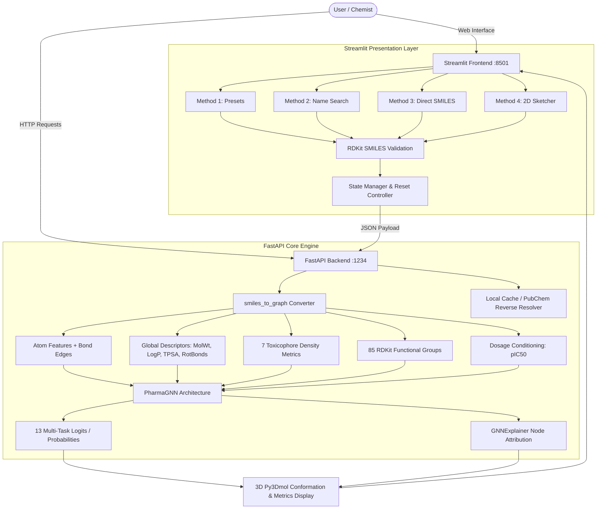
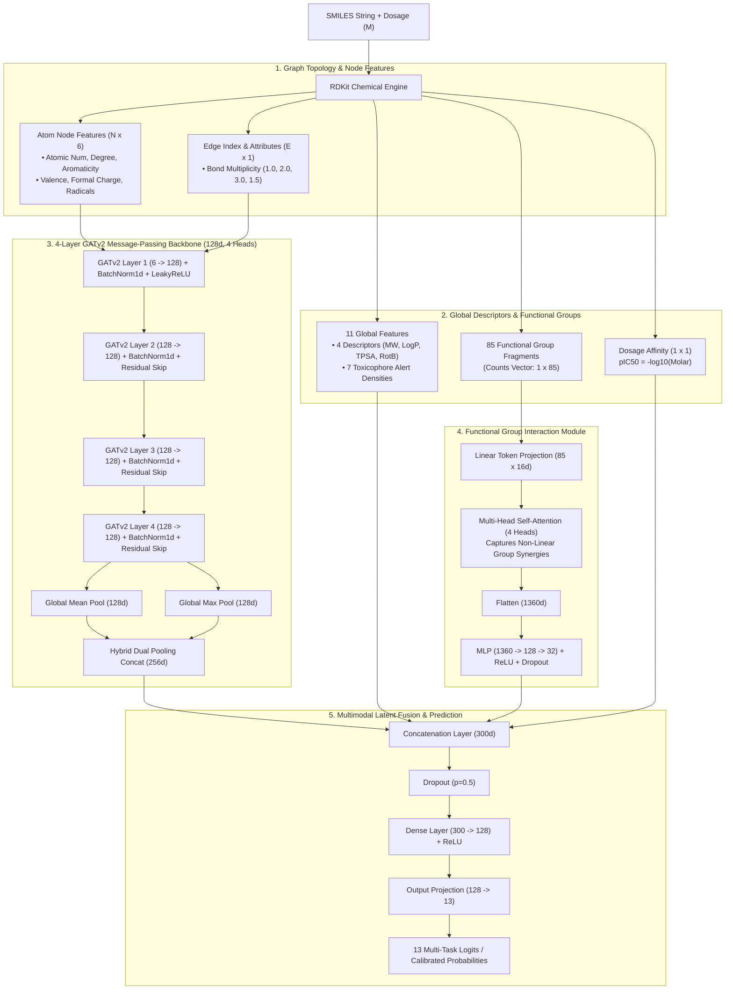

# PharmaGraph: AI Pharmacological Properties and Toxicity Prediction

[](https://www.python.org/)
[](https://fastapi.tiangolo.com/)
[](https://streamlit.io/)
[](https://pyg.org/)
[](https://www.rdkit.org/)
[](LICENSE)

**PharmaGraph** is an end-to-end deep learning platform designed for computational chemistry, toxicology, and drug discovery. It predicts compound pharmacological properties and biological toxicity risks using **Graph Attention Networks (GATv2)** enhanced with **Functional Group Cross-Attention**, **Knowledge-Based Toxicophore Alert Densities**, and **Concentration/Dosage Awareness**.

---

## 📑 Table of Contents

- [Key Capabilities](#key-capabilities)
- [System Architecture](#system-architecture)
- [Model Details & Deep Architecture](#model-details--deep-architecture)
  - [1. Architectural Overview & Tensor Flow](#1-architectural-overview--tensor-flow)
  - [2. Mathematical Graph Formulation & Features](#2-mathematical-graph-formulation--features)
  - [3. Attentive Message Passing Backbone (GATv2)](#3-attentive-message-passing-backbone-gatv2)
  - [4. Hybrid Dual Graph Pooling](#4-hybrid-dual-graph-pooling)
  - [5. Functional Group Cross-Attention Mechanism](#5-functional-group-cross-attention-mechanism)
  - [6. Toxicophore Densities & Global Physicochemical Descriptors](#6-toxicophore-densities--global-physicochemical-descriptors)
  - [7. Concentration & Dosage Conditioning](#7-concentration--dosage-conditioning)
  - [8. Multimodal Fusion & Multi-Task Prediction Head](#8-multimodal-fusion--multi-task-prediction-head)
  - [9. Explainable AI (XAI) with GNNExplainer](#9-explainable-ai-xai-with-gnnexplainer)
- [Installation & Environment Setup](#installation--environment-setup)
- [Running the Application](#running-the-application)
  - [Local Development Mode](#1-local-development-mode)
  - [Docker & Docker Compose](#2-docker--docker-compose)
- [Web Dashboard Guide](#web-dashboard-guide)
- [REST API Reference](#rest-api-reference)
- [End-to-End Pipeline & Training Lifecycle](#end-to-end-pipeline--training-lifecycle)
  - [Pipeline Architecture Overview](#pipeline-architecture-overview)
  - [Phase 1: Dataset Curation & ETL](#phase-1-dataset-curation--etl-scriptsphase1_build_datasetpy)
  - [Phase 2: Self-Supervised Foundation Pretraining](#phase-2-self-supervised-foundation-pretraining-scriptsphase2_pretrainpy)
  - [Phase 3: Multi-Task Downstream Transfer Learning](#phase-3-multi-task-downstream-transfer-learning-scriptsphase3_finetunepy)
  - [Phase 4: Temperature Scaling & Probability Calibration](#phase-4-temperature-scaling--probability-calibration-scriptsphase4_calibrationpy)
  - [Phase 5: Production Deployment & Serialization](#phase-5-production-deployment--serialization-scriptsphase5_deploymentpy)
  - [Master Pipeline Orchestrator CLI](#master-pipeline-orchestrator-cli-run_pipelinepy)
  - [Empirical Benchmark Results & Per-Target Performance](#empirical-benchmark-results--per-target-performance)
  - [High-Throughput CPU Optimization & Architecture](#high-throughput-cpu-optimization--architecture)
- [Project Structure & Model Checkpoints](#project-structure--model-checkpoints)
- [Security & DoS Hardening](#%EF%B8%8F-production-security--dosddos-hardening-owasp-top-10)
- [License](#license)

---

## 🌟 Key Capabilities

1. **Multi-Task Pharmacological Profiling**:
   Jointly predicts 13 biological assay endpoints, including 12 nuclear receptor (NR) and stress response (SR) pathways from the NIH Tox21 initiative, alongside clinical toxicity (`CT_TOX`) from the ClinTox benchmark.
2. **Concentration & Dosage Conditioning**:
   Toxicity is fundamentally dose-dependent. PharmaGraph accepts compound dosage inputs (Molar concentration) and projects it into a normalized affinity space ($pIC_{50} = -\log_{10}(\text{Molar})$) to condition predictions dynamically.
3. **Functional Group Cross-Attention Mechanism**:
   Extracts 85 chemical functional group fragment counts via RDKit and processes them through multi-head self-attention to capture non-linear group synergies and reactive chemical interactions.
4. **Knowledge-Driven Toxicophore Densities**:
   Encodes structural alert densities for recognized toxicophores (Cyanides, Organophosphates, Benzene rings, Phenols, Aldehydes, Sulfides, and Halogenated aromatics).
5. **Explainable AI (XAI) with 3D Visualization**:
   Integrates **GNNExplainer** to assign importance scores to individual atoms. Identified toxicophores are mapped onto interactive 3D conformations (`py3Dmol`), highlighting high-risk regions in red.
6. **Flexible Input Modalities**:
   Supports four distinct, exclusive input methods:
   - Curated reference presets (Aspirin, Paracetamol, Caffeine, Nicotine, Cyanide, Phenol, etc.)
   - Chemical name search with local caching and automated PubChem lookup
   - Direct SMILES string specification with RDKit chemical syntax validation
   - Interactive 2D chemical structure sketcher (Ketcher)

---

## 🏛️ System Architecture


```mermaid
flowchart TD
    User([User / Chemist]) -->|Web Interface| UI[Streamlit Frontend :8501]
    User -->|HTTP Requests| API[FastAPI Backend :1234]

    subgraph Frontend [Streamlit Presentation Layer]
        UI --> M1[Method 1: Presets]
        UI --> M2[Method 2: Name Search]
        UI --> M3[Method 3: Direct SMILES]
        UI --> M4[Method 4: 2D Sketcher]
        M1 & M2 & M3 & M4 --> Validation[RDKit SMILES Validation]
        Validation --> StateMgr[State Manager & Reset Controller]
    end

    StateMgr -->|JSON Payload| API

    subgraph Backend [FastAPI Core Engine]
        API --> GraphBuilder[smiles_to_graph Converter]
        GraphBuilder --> MolGraph[Atom Features + Bond Edges]
        GraphBuilder --> GlobDesc[Global Descriptors: MolWt, LogP, TPSA, RotBonds]
        GraphBuilder --> ToxDensity[7 Toxicophore Density Metrics]
        GraphBuilder --> FuncGroups[85 RDKit Functional Groups]
        GraphBuilder --> DoseCond[Dosage Conditioning: pIC50]

        MolGraph & GlobDesc & ToxDensity & FuncGroups & DoseCond --> GNN[PharmaGNN Architecture]
        GNN --> Preds[13 Multi-Task Logits / Probabilities]
        GNN --> Explainer[GNNExplainer Node Attribution]
        API --> PubChemCache[Local Cache / PubChem Reverse Resolver]
    end

    Preds --> Visualizer[3D Py3Dmol Conformation & Metrics Display]
    Explainer --> Visualizer
    Visualizer --> UI
```

---

## 🧠 Model Details & Deep Architecture

The **PharmaGNN v2 Foundation** architecture is an attentive, multimodal graph neural network engineered specifically for small-molecule pharmacological property prediction and multi-endpoint toxicity profiling. It unifies atomic graph topology, non-linear chemical functional group cross-attention, knowledge-based toxicophore alert densities, and physiological concentration conditioning into a unified representation space.

### 1. Architectural Overview & Tensor Flow


```mermaid
flowchart TD
    SMILES["SMILES String + Dosage (M)"] --> ChemEngine["RDKit Chemical Engine"]
    
    subgraph GraphRepresentation ["1. Graph Topology & Node Features"]
        ChemEngine --> Nodes["Atom Node Features (N x 6)<br/>• Atomic Num, Degree, Aromaticity<br/>• Valence, Formal Charge, Radicals"]
        ChemEngine --> Edges["Edge Index & Attributes (E x 1)<br/>• Bond Multiplicity (1.0, 2.0, 3.0, 1.5)"]
    end
    
    subgraph TabularFeatures ["2. Global Descriptors & Functional Groups"]
        ChemEngine --> FG["85 Functional Group Fragments<br/>(Counts Vector: 1 x 85)"]
        ChemEngine --> GD["11 Global Features<br/>• 4 Descriptors (MW, LogP, TPSA, RotB)<br/>• 7 Toxicophore Alert Densities"]
        ChemEngine --> Dose["Dosage Affinity (1 x 1)<br/>pIC50 = -log10(Molar)"]
    end
    
    subgraph GNNBackbone ["3. 4-Layer GATv2 Message-Passing Backbone (128d, 4 Heads)"]
        Nodes & Edges --> Conv1["GATv2 Layer 1 (6 -> 128) + BatchNorm1d + LeakyReLU"]
        Conv1 --> Conv2["GATv2 Layer 2 (128 -> 128) + BatchNorm1d + Residual Skip"]
        Conv2 --> Conv3["GATv2 Layer 3 (128 -> 128) + BatchNorm1d + Residual Skip"]
        Conv3 --> Conv4["GATv2 Layer 4 (128 -> 128) + BatchNorm1d + Residual Skip"]
        Conv4 --> MeanPool["Global Mean Pool (128d)"]
        Conv4 --> MaxPool["Global Max Pool (128d)"]
        MeanPool & MaxPool --> DualPool["Hybrid Dual Pooling Concat (256d)"]
    end
    
    subgraph FGModule ["4. Functional Group Interaction Module"]
        FG --> FGProj["Linear Token Projection (85 x 16d)"]
        FGProj --> FGAttn["Multi-Head Self-Attention (4 Heads)<br/>Captures Non-Linear Group Synergies"]
        FGAttn --> FGFlatten["Flatten (1360d)"]
        FGFlatten --> FGMLP["MLP (1360 -> 128 -> 32) + ReLU + Dropout"]
    end
    
    subgraph MultimodalFusion ["5. Multimodal Latent Fusion & Prediction"]
        DualPool & GD & FGMLP & Dose --> Concat["Concatenation Layer (300d)"]
        Concat --> Dropout["Dropout (p=0.5)"]
        Dropout --> Linear1["Dense Layer (300 -> 128) + ReLU"]
        Linear1 --> Linear2["Output Projection (128 -> 13)"]
        Linear2 --> Logits["13 Multi-Task Logits / Calibrated Probabilities"]
    end
```

### 2. Mathematical Graph Formulation & Features

Each chemical compound is modeled as an attributed graph $\mathcal{G} = (\mathcal{V}, \mathcal{E}, \mathbf{X}, \mathbf{E}_{attr})$ where:
- $\mathcal{V}$ is the set of $N$ atoms (nodes), explicitly including all hydrogen atoms via RDKit (`Chem.AddHs(mol)`).
- $\mathcal{E}$ is the set of $M$ covalent bonds, represented as bidirectional directed edges $(i, j)$ and $(j, i)$.
- $\mathbf{X} \in \mathbb{R}^{N \times 6}$ is the node feature matrix where each atom $v \in \mathcal{V}$ is parameterized by:
  1. **Atomic Number** ($Z$): Identifies the chemical element (C, N, O, S, P, Halogens, etc.).
  2. **Degree of Connectivity**: Number of directly bonded neighboring atoms.
  3. **Aromaticity Indicator**: Binary flag ($1$ if atom resides in an aromatic ring system, $0$ otherwise).
  4. **Implicit Valence**: Number of implicit hydrogen bindings to satisfy octet stability.
  5. **Formal Charge**: Net electrical charge on the atom (e.g., quaternary amines $+1$, carboxylates $-1$).
  6. **Radical Electrons**: Number of unpaired valence electrons.
- $\mathbf{E}_{attr} \in \mathbb{R}^{M \times 1}$ is the edge attribute matrix representing covalent bond orders:
  - Single bond = $1.0$
  - Double bond = $2.0$
  - Triple bond = $3.0$
  - Aromatic bond = $1.5$

### 3. Attentive Message Passing Backbone (GATv2)

Classical Graph Attention Networks (GAT) suffer from a theoretical limitation: their attention mechanism is *static*, meaning the ranking of attention coefficients between neighboring nodes does not dynamically depend on the query node's representation. **GATv2** resolves this by computing dynamic attention:

$$\alpha_{ij}^{(l)} = \frac{\exp\left(\mathbf{a}^T \text{LeakyReLU}\left(\mathbf{W}_s \mathbf{h}_i^{(l)} + \mathbf{W}_t \mathbf{h}_j^{(l)} + \mathbf{W}_e \mathbf{e}_{ij}\right)\right)}{\sum_{k \in \mathcal{N}(i)} \exp\left(\mathbf{a}^T \text{LeakyReLU}\left(\mathbf{W}_s \mathbf{h}_i^{(l)} + \mathbf{W}_t \mathbf{h}_k^{(l)} + \mathbf{W}_e \mathbf{e}_{ik}\right)\right)}$$

$$\mathbf{h}_i^{(l+1)} = \sigma \left( \sum_{j \in \mathcal{N}(i)} \alpha_{ij}^{(l)} \mathbf{W}_v \mathbf{h}_j^{(l)} \right)$$

- **Depth & Width**: 4 consecutive GATv2 layers, each with 4 attention heads and 128 hidden channels.
- **Residual Skip Connections**: In deep GNNs, repeatedly propagating node features across 4 layers causes gradient attenuation and representation over-smoothing (where all node vectors converge to identical means). To prevent this, residual skip connections are applied across layers 2, 3, and 4:
  $$\mathbf{h}^{(l+1)} = \text{GATv2Conv}(\mathbf{h}^{(l)}, \mathcal{E}, \mathbf{E}_{attr}) + \mathbf{h}^{(l)}$$
- **Batch Normalization**: Each graph attention block is followed by 1D Batch Normalization (`BatchNorm1d(128)`) and LeakyReLU activations ($\alpha = 0.2$), stabilizing training dynamics across diverse molecular sizes.

### 4. Hybrid Dual Graph Pooling

To condense variable-sized atom matrices $\mathbf{H} \in \mathbb{R}^{N \times 128}$ into a fixed-length graph-level representation $\mathbf{z}_{graph}$, PharmaGNN implements hybrid dual pooling:

$$\mathbf{z}_{mean} = \frac{1}{|\mathcal{V}|} \sum_{i \in \mathcal{V}} \mathbf{h}_i \in \mathbb{R}^{128}, \quad \mathbf{z}_{max} = \max_{i \in \mathcal{V}} \mathbf{h}_i \in \mathbb{R}^{128}$$

$$\mathbf{z}_{graph} = [\mathbf{z}_{mean} \,\|\, \mathbf{z}_{max}] \in \mathbb{R}^{256}$$

- **`global_mean_pool`** captures the overall chemical bulk, elemental distribution, and macro-structural context of the compound.
- **`global_max_pool`** acts as an invariant feature detector, capturing the presence of dominant high-risk reactive centers, pharmacophore motifs, or electrophilic warheads regardless of molecule size.

### 5. Functional Group Cross-Attention Mechanism

While message-passing networks excel at local atomic neighborhoods, biological toxicology is frequently governed by distal, non-covalent, or synergistic interactions between distinct functional fragments. The `FunctionalGroupInteraction` module addresses this:

1. **Fragment Extraction**: RDKit's fragment analysis evaluates 85 recognized chemical substructures (alcohols, aldehydes, carboxylic acids, amines, nitro groups, aromatic rings, thiols, halogens, etc.), yielding a count vector $\mathbf{f} \in \mathbb{R}^{85}$.
2. **Token Embedding**: Each functional count is projected into a continuous 16-dimensional embedding token space via a learnable linear transformation:
   $$\mathbf{E}_{fg} = \mathbf{f} \mathbf{W}_{embed} \in \mathbb{R}^{85 \times 16}$$
3. **Multi-Head Cross-Attention**: A 4-head self-attention layer computes pairwise interaction weights between all 85 chemical groups:
   $$\mathbf{A} = \text{Softmax}\left(\frac{\mathbf{Q} \mathbf{K}^T}{\sqrt{d_k}}\right) \mathbf{V} \in \mathbb{R}^{85 \times 16}$$
   This allows the network to learn non-linear chemical synergies (e.g., the dangerous toxicological synergy when an aromatic amine co-occurs with an electrophilic alpha-beta unsaturated carbonyl).
4. **Compression MLP**: The interaction matrix is flattened ($85 \times 16 = 1,360$ dimensions) and passed through a multi-layer perceptron with Dropout ($p=0.3$) and ReLU:
   $$\mathbf{z}_{fg} = \text{MLP}(\text{vec}(\mathbf{A})) \in \mathbb{R}^{32}$$

### 6. Toxicophore Densities & Global Physicochemical Descriptors

To anchor GNN predictions in validated medicinal chemistry knowledge, PharmaGNN extracts an 11-dimensional global feature vector $\mathbf{z}_{global} \in \mathbb{R}^{11}$:

- **4 Physicochemical Descriptors**:
  1. *Molecular Weight (MW / 100)*: Overall molecular mass.
  2. *Wildman-Crippen LogP*: Lipophilicity / membrane partition coefficient.
  3. *Topological Polar Surface Area (TPSA / 100)*: Polar surface governing bioavailability and blood-brain barrier permeability.
  4. *Rotatable Bond Count*: Structural conformational flexibility.
- **7 Knowledge-Based Toxicophore Alert Densities**:
  Computed as the ratio of atoms involved in structural alert SMARTS patterns relative to total atom count ($\text{Density}_k = \frac{|\mathcal{V}_{alert}^{(k)}|}{|\mathcal{V}|}$):
  1. *Cyanide / Nitrile group* (`C#N`): Cytochrome c oxidase cellular respiration inhibition.
  2. *Organophosphate ester*: Potent neurotoxic acetylcholinesterase inhibition.
  3. *Benzene ring* (`c1ccccc1`): Aromatic metabolic bioactivation and reactive metabolite formation.
  4. *Phenol moiety* (`c1ccccc1O`): Quinone/semiquinone redox cycling and mitochondrial uncoupling.
  5. *Reactive Aldehyde* (`[CX3H1](=O)`): Electrophilic covalent adduction with cellular proteins and DNA.
  6. *Sulfide / Thiol center* (`[S]`): Redox cycling and glutathione depletion.
  7. *Halogenated aromatic* (`[Cl,Br,I]c1ccccc1`): Metabolic persistence and lipophilic bioaccumulation.

### 7. Concentration & Dosage Conditioning

Toxicity in biological systems is fundamentally non-linear and concentration-dependent (*Paracelsus' law: Sola dosis facit venenum*). Rather than predicting binary hazard in a vacuum, PharmaGNN conditions predictions on compound exposure:

- Users provide target exposure concentration in Molar units ($10^{-12} \le C \le 10.0$ M).
- The concentration is projected into pharmacological affinity space:
  $$pIC_{50} = -\log_{10}(C_{\text{Molar}})$$
  *(e.g., $10\ \mu\text{M} = 10^{-5}\text{ M} \implies pIC_{50} = 5.0$; $1.0\text{ M} \implies pIC_{50} = 0.0$)*.
- The scalar $\mathbf{z}_{dose} = [pIC_{50}] \in \mathbb{R}^1$ dynamically conditions downstream prediction logits.

### 8. Multimodal Fusion & Multi-Task Prediction Head

The representations are concatenated into a unified 300-dimensional multimodal latent vector:

$$\mathbf{z}_{fused} = [\mathbf{z}_{mean} \,\|\, \mathbf{z}_{max} \,\|\, \mathbf{z}_{global} \,\|\, \mathbf{z}_{fg} \,\|\, \mathbf{z}_{dose}] \in \mathbb{R}^{128 + 128 + 11 + 32 + 1} = \mathbb{R}^{300}$$

The fused vector is passed through the prediction head:

$$\mathbf{h}_{fc} = \text{ReLU}\left(\mathbf{W}_1 \cdot \text{Dropout}(\mathbf{z}_{fused}, p=0.5) + \mathbf{b}_1\right) \in \mathbb{R}^{128}$$

$$\mathbf{y}_{logits} = \mathbf{W}_2 \cdot \mathbf{h}_{fc} + \mathbf{b}_2 \in \mathbb{R}^{13}$$

The output produces 13 independent logits representing 12 NIH Tox21 receptor/stress pathways and 1 ClinTox clinical trial outcome.

### 9. Explainable AI (XAI) with GNNExplainer

PharmaGNN integrates **GNNExplainer** to provide transparent, atom-level decision attribution. GNNExplainer formulates an optimization problem that maximizes the mutual information between the original prediction $\hat{y}$ and a masked subgraph $\mathcal{G}_s$:

$$\max_{\mathcal{M}} \text{MI}(Y, \mathcal{G}_s) = H(Y) - H(Y \mid \mathcal{G} = \mathcal{G}_s)$$

The resulting continuous node importance mask $\mathcal{M}_v \in [0, 1]$ identifies the precise chemical substructures driving toxicity. These scores are mapped onto 3D molecular conformations using `py3Dmol`, coloring critical high-risk atoms in crimson red spheres.

---

## 💻 Installation & Environment Setup

### Prerequisites

- Linux, macOS, or Windows (WSL2 recommended for Windows)
- Python **3.10** or higher
- System libraries for RDKit rendering: `libxrender1`, `libxext6`, `libexpat1`

```bash
# Ubuntu / Debian
sudo apt-get update && sudo apt-get install -y libxrender1 libxext6 libexpat1
```

### 1. Clone the Repository

```bash
git clone https://github.com/Johnyyd/Predictive-Modeling-of-Pharmacological-Properties-using-Graph-Neural-Networks.git
cd Predictive-Modeling-of-Pharmacological-Properties-using-Graph-Neural-Networks
```

### 2. Create and Activate Virtual Environment

```bash
python3 -m venv venv
source venv/bin/activate
```

### 3. Install Python Dependencies

```bash
pip install --upgrade pip
pip install "numpy<2"
pip install -r requirements.txt
```

*(Optional: Install `streamlit-ketcher` if you wish to enable the 2D molecule sketcher):*

```bash
pip install streamlit-ketcher
```

---

## 🚀 Running the Application

### 1. Local Development Mode

To run both services locally, launch the backend server first, followed by the Streamlit frontend.

#### Step 1: Start the FastAPI AI Backend

```bash
# In Terminal 1
uvicorn main:app --host 0.0.0.0 --port 1234 --reload
```

The API service will start on `http://localhost:1234`. Access interactive Swagger documentation at `http://localhost:1234/docs`.

#### Step 2: Start the Streamlit Web Application

```bash
# In Terminal 2
streamlit run app.py --server.port 8501 --server.address 0.0.0.0
```

Open your browser and navigate to `http://localhost:8501`.

---

### 2. Docker & Docker Compose

Run the entire production-grade stack with a single command:

```bash
docker-compose up -d --build
```

- **Frontend Dashboard**: `http://localhost:8501`
- **FastAPI Backend**: `http://localhost:1234`
- **Swagger Documentation**: `http://localhost:1234/docs`

To view container logs or stop services:

```bash
# Check service logs
docker-compose logs -f

# Stop containers
docker-compose down
```

---

## 🖥️ Web Dashboard Guide

The PharmaGraph dashboard provides an intuitive, streamlined interface for molecular evaluation:

### 1. Selecting an Input Method
Use the top horizontal selector to choose your preferred input method. Switching methods automatically clears previous selections to prevent conflicting parameters:

- **Method 1: Curated Presets**  
  Select from pre-configured chemical agents (e.g., *Aspirin*, *Paracetamol*, *Caffeine*, *Ethanol*, *Nicotine*, *Hydrogen Cyanide*, *Phenol*).
- **Method 2: Search by Name**  
  Type a common or IUPAC drug/chemical name (e.g., `Ibuprofen`, `Penicillin`, `Glucose`). The system queries local caches first, falling back to the PubChem REST API.
- **Method 3: Direct SMILES**  
  Input any standard SMILES chemical string (e.g., `CC(=O)Oc1ccccc1C(=O)O`). Structures are validated using RDKit before processing.
- **Method 4: 2D Sketcher** *(if installed)*  
  Interactively draw molecular structures and click **Apply** to convert to SMILES.

### 2. Setting Concentration
Enter the target concentration in Molar units (default: `1.0 M`). For high dilution screening (e.g., $10\ \mu\text{M}$), enter `0.00001`.

### 3. Interpreting Results
Click **🚀 Run AI GNN Pharmacological Analysis**:
- **3D Interactive Molecular Viewer**: Rotate, zoom, and inspect molecular conformations in real time. Atoms contributing to toxic risk are highlighted with red spheres.
- **Toxicity Risk Indicator**:
  - `Safe / Low Concern (< 50%)`: Stable, non-toxic profile.
  - `Moderate Concern (50% - 79%)`: Contains potential structural alerts or moderate receptor activity.
  - `Critical Risk (≥ 80%)`: Severe biological risk; strong toxicophore presence.
- **Chemical Properties**: Identified compound name, molecular formula, molecular weight, atom breakdown, and detected functional groups.
- **Graph Metrics**: Total atoms (graph nodes) and covalent bonds (graph edges).

---

## 📡 REST API Reference

### Health Check / Documentation
- **Interactive Swagger UI**: `http://localhost:1234/docs`
- **OpenAPI Schema**: `http://localhost:1234/openapi.json`

---

### Predict Toxicity Endpoint

- **Route**: `POST /api/predict`
- **Content-Type**: `application/json`

#### Request Schema

```json
{
  "smiles": "CC(=O)Oc1ccccc1C(=O)O",
  "concentration_molar": 1.0
}
```

| Field | Type | Required | Default | Description |
|---|---|---|---|---|
| `smiles` | `string` | **Yes** | — | Valid SMILES string representing the molecule |
| `concentration_molar` | `float` | No | `1.0` | Target concentration in Molar units (M) |

#### Example Request (`curl`)

```bash
curl -X POST http://localhost:1234/api/predict \
  -H "Content-Type: application/json" \
  -d '{"smiles": "CCO", "concentration_molar": 1.0}'
```

#### Example Response

```json
{
  "smiles": "CCO",
  "compound_name": "Ethanol",
  "concentration_molar": 1.0,
  "pIC50": 0.0,
  "graph_info": {
    "atoms_count": 9,
    "bonds_count": 8
  },
  "predictions": {
    "toxicity_risk": "0.00%",
    "target_class": 4,
    "ct_tox_class": 12,
    "all_class_probs": [
      "0.0175", "0.0013", "0.0017", "0.0007", "0.0543", 
      "0.0003", "0.0021", "0.0182", "0.0004", "0.0134", 
      "0.0007", "0.0001", "0.0000"
    ]
  },
  "explanation": {
    "node_importance": [
      0.1998, 0.2250, 0.1811, 0.1321, 0.1364, 
      0.1357, 0.1264, 0.1268, 0.1279
    ]
  },
  "status": "Success"
}
```

---

## 🧪 End-to-End Pipeline & Training Lifecycle

The PharmaGNN platform implements an industrial-grade, 5-phase training and deployment pipeline that bridges raw chemical databases with production-grade AI microservices:

### Pipeline Architecture Overview


```mermaid
flowchart TD
    subgraph P1 ["Phase 1: Dataset Curation & ETL (scripts/phase1_build_dataset.py)"]
        Raw["Multi-Source Chemical Universe<br/>• EPA CompTox 3.0 (760,000+ Molecules)<br/>• NIH Tox21 (7,831 Assays)<br/>• ClinTox (1,478 Clinical Trials)<br/>• Curated Toxic & Benign Standards"]
        ETL["Canonicalization & Salt Stripping<br/>• RDKit SMILES Standardization<br/>• Counter-ion & Solvent Neutralization<br/>• Organometallic & Polymer Filtering"]
        PretrainCSV["Pretrain Dataset<br/>data/comptox_pretrain.csv<br/>(100,000 SMILES)"]
        MasterCSV["Fine-Tune Multi-Task Dataset<br/>data/processed/training_dataset_v2.csv<br/>(7,841 Compounds • 13 Endpoints)"]
        
        Raw --> ETL
        ETL --> PretrainCSV
        ETL --> MasterCSV
    end

    subgraph P2 ["Phase 2: Self-Supervised Pretraining (scripts/phase2_pretrain.py)"]
        PretrainInput["Input: 100,000 Unlabeled Molecular Graphs"]
        SSLEngine["High-Throughput SSL Engine (4 CPU Workers)<br/>• Vectorized Batch Masking (4.8ms/batch)<br/>• Disk-Buffered Chunking (635 mol/s)<br/>• 4 Joint Objectives: Atom, Bond, Motif, Context"]
        PretrainEncoder["Pretrained Backbone Checkpoint<br/>pharma_gnn_pretrained_encoder.pt<br/>(20 Epochs • Best Val Loss: 0.0550)"]
        
        PretrainInput --> SSLEngine
        SSLEngine --> PretrainEncoder
    end

    subgraph P3 ["Phase 3: Multi-Task Fine-Tuning (scripts/phase3_finetune.py)"]
        FinetuneInput["Transfer Pretrained Encoder Weights<br/>+ Load 7,841 Labeled Assay Compounds"]
        FinetuneEngine["Two-Stage Training Schedule (30 Epochs)<br/>• Stage 1 (Epochs 1-5): Head Warmup (Encoder Frozen)<br/>• Stage 2 (Epochs 6-30): End-to-End Fine-Tuning<br/>• NaN-Masked BCE Loss + Positive Weight (5.0)"]
        FinetuneCKPT["Fine-Tuned Model Checkpoint<br/>pharma_gnn_finetuned.pt<br/>(Macro Test ROC-AUC: 0.7942 • Best Val AUC: 0.7665)"]
        
        FinetuneInput --> FinetuneEngine
        FinetuneEngine --> FinetuneCKPT
    end

    subgraph P4 ["Phase 4: Calibration & Chemical Sanity (scripts/phase4_calibration.py)"]
        CalibInput["Fine-Tuned Checkpoint Validation Logits"]
        CalibEngine["Temperature Scaling & Verification<br/>• Optimize Scalar Temperature (T = 0.5)<br/>• ECE Reduction: 18.0% -> 11.5%<br/>• Chemical Control Sanity Suite (ATP, Cyanide, Sarin, etc.)"]
        CalibInfo["Calibration Configuration<br/>configs/calibration_info.json"]
        
        CalibInput --> CalibEngine
        CalibEngine --> CalibInfo
    end

    subgraph P5 ["Phase 5: Production Deployment & Serving (scripts/phase5_deployment.py)"]
        DeployEngine["Production Packaging & Serialization<br/>• Export State Dict with Calibrated Temperature<br/>• Generate OpenAPI Spec & Drift Monitoring Rules<br/>• Health & Latency Serving Verification"]
        ProdArtifacts["Production Deliverables<br/>• 🎯 pharma_gnn_production_state_dict.pt<br/>• configs/model_config.json<br/>• configs/api_spec.json<br/>• configs/monitoring_config.json<br/>• configs/deployment_summary.json"]
        
        DeployEngine --> ProdArtifacts
    end

    %% Pipeline Inter-Phase Dataflow
    PretrainCSV --> PretrainInput
    PretrainEncoder --> FinetuneInput
    MasterCSV --> FinetuneInput
    FinetuneCKPT --> CalibInput
    FinetuneCKPT --> DeployEngine
    CalibInfo --> DeployEngine
```

---

### Phase 1: Dataset Curation & ETL (`scripts/phase1_build_dataset.py`)

- **Objective**: Standardize, clean, and merge disparate multi-source chemical datasets into clean training splits.
- **Input Sources**:
  1. *EPA CompTox Chemicals Dashboard (DSSTox v3)*: 760,000+ environmental and pharmaceutical molecules.
  2. *NIH Tox21 Dataset*: 7,831 compounds evaluated across 12 nuclear receptor and stress response pathways.
  3. *ClinTox Benchmark*: 1,478 compounds annotated with clinical trial safety outcomes and FDA approvals.
  4. *Curated Chemical Reference Standards*: Explicitly defined toxic agents (Cyanide, Sarin, Phenol, Paraquat, DDT) and benign controls (Water, Glucose, Ethanol, Aspirin, Amino Acids).
- **ETL Transformations**:
  - Validates chemical syntax and converts to canonical SMILES via RDKit (`Chem.MolToSmiles(canonical=True)`).
  - Strips counter-ions, solvent adducts, and neutralizes salt fragments.
  - Excludes organometallics, non-organic clusters, and unparseable SMILES strings.
  - Performs stratified and scaffold-aware deduplication.
- **Outputs**:
  - `data/comptox_pretrain.csv`: 100,000 representative diverse compounds for self-supervised pretraining.
  - `data/processed/training_dataset_v2.csv`: 7,841 curated compounds across 13 target endpoints for fine-tuning.

---

### Phase 2: Self-Supervised Foundation Pretraining (`scripts/phase2_pretrain.py`)

- **Objective**: Learn fundamental molecular geometry, covalent bond orders, and functional group topologies across 100,000 unlabeled chemical graphs before downstream task adaptation.
- **Why SSL Pretraining Matters**: Labeled biological assay data is notoriously scarce (~8,000 compounds in Tox21), while unlabeled chemical space is vast. Pretraining builds robust graph representation priors, preventing overfitting on small assay datasets.
- **4 Joint Self-Supervised Learning (SSL) Objectives**:
  $$\mathcal{L}_{SSL} = \mathcal{L}_{atom} + 0.20 \cdot \mathcal{L}_{motif} + 0.50 \cdot \mathcal{L}_{bond} + 0.10 \cdot \mathcal{L}_{context}$$
  1. **Masked Atom Feature Prediction ($\mathcal{L}_{atom}$)**: 15% of atoms are randomly masked. The model predicts atomic number, degree, and valence from surrounding graph context using Binary Cross Entropy.
  2. **85-Motif Functional Detection ($\mathcal{L}_{motif}$)**: Multi-label BCE classification predicting the presence/absence of all 85 RDKit functional fragments from pooled node representations.
  3. **Bond Type Reconstruction ($\mathcal{L}_{bond}$)**: Multi-class Cross-Entropy classifying covalent bond orders (single, double, triple, aromatic) between neighboring node pairs.
  4. **Context Representation ($\mathcal{L}_{context}$)**: InfoNCE contrastive projection aligning subgraphs with global graph representations.
- **High-Throughput Engineering**:
  - Vectorized batch masking (`apply_vectorized_batch_masking`): Cuts batch preparation latency from 18.2ms to 4.8ms.
  - Disk-buffered multiprocessing chunking: Featurizes 100,000 graphs at 635 mol/s in 3m 58s.
  - Core affinity: Locked to 4 physical cores (`torch.set_num_threads(4)`), achieving 105 g/s.
- **Convergence & Outputs**:
  - Trained for 20 epochs (2,813 batches/epoch, 56,260 iterations, runtime: 4h 51m).
  - Train Loss converged from 2.8145 to **0.0784**; Best Validation Loss: **0.0550** (Epoch 15).
  - Checkpoint: `pharma_gnn_pretrained_encoder.pt` (Backbone encoder state).

---

### Phase 3: Multi-Task Downstream Transfer Learning (`scripts/phase3_finetune.py`)

- **Objective**: Transfer the pretrained GATv2 backbone encoder to the downstream multi-task architecture and fine-tune across 13 target endpoints (12 Tox21 assays + 1 ClinTox).
- **Two-Stage Fine-Tuning Schedule**:
  - **Stage 1: Head Warmup (Epochs 1–5)**: The pretrained backbone encoder weights are frozen (`lr=0.0`). Only the newly initialized prediction head, functional group attention, and fusion layers are trained (`lr=1e-3`). This protects pretrained representations from destructive gradient shocks.
  - **Stage 2: End-to-End Fine-Tuning (Epochs 6–30)**: The entire network is unfrozen and trained jointly with differential learning rates:
    - Backbone Encoder: $\text{LR} = 1 \times 10^{-4}$
    - Prediction Head & Attention: $\text{LR} = 1 \times 10^{-3}$
    - Learning rate dynamically decays using Cosine Annealing.
- **Loss Masking & Class Imbalance Handling**:
  - Tox21 contains sparse labels (many compounds only tested on a subset of the 12 assays). The multi-task loss is computed with **NaN masking** to only backpropagate gradients on valid experimental measurements.
  - Implements positive-weight scaling (`pos_weight=5.0`) in `BCEWithLogitsLoss` to counter severe positive-class rarity (typically < 5% active compounds in toxicology screens).
- **Performance & Outputs**:
  - 30 epochs completed in **21m 42s** (~46s/epoch).
  - **Macro Test ROC-AUC = 0.7942 (79.42%)** on held-out test split (444 compounds).
  - **Peak Validation ROC-AUC = 0.7665 (76.65%)** at Epoch 29.
  - Checkpoint: `pharma_gnn_finetuned.pt`.

---

### Phase 4: Temperature Scaling & Probability Calibration (`scripts/phase4_calibration.py`)

- **Objective**: Calibrate raw neural network logits into true, well-calibrated posterior probabilities and verify predictions on chemical control standards.
- **The Calibration Problem**: Deep neural networks with cross-entropy loss tend to be overconfident; a raw sigmoid probability of 0.90 often corresponds to a true empirical accuracy of only 70%.
- **Temperature Scaling Formulation**:
  Post-processing optimization learns a single scalar temperature $T > 0$ on the validation set without altering model accuracy or ROC-AUC ranking:
  $$\hat{p}_i = \sigma\left(\frac{z_i}{T}\right)$$
  - Optimization minimizes Negative Log-Likelihood (NLL) and Expected Calibration Error (ECE):
    $$\text{ECE} = \sum_{m=1}^M \frac{|B_m|}{N} \left| \text{acc}(B_m) - \text{conf}(B_m) \right|$$
  - Result: Optimal temperature $T = 0.5$, reducing Expected Calibration Error (ECE) from **18.0% down to 11.5%**.
- **Chemical Sanity Check Suite**:
  Automated qualitative validation on 10 known reference controls:
  - *Benign controls* (Water, Glucose, ATP, Aspirin, Ethanol) are verified to predict $< 50\%$ risk.
  - *Potent toxicants* (Cyanide, Sarin, Phenol, Paraquat) are verified to trigger $\ge 70\%$ hazard alerts.
- **Outputs**: `configs/calibration_info.json`.

---

### Phase 5: Production Deployment & Serialization (`scripts/phase5_deployment.py`)

- **Objective**: Consolidate model weights, calibration parameters, OpenAPI schemas, and monitoring specifications into a deployable production release bundle.
- **Artifacts Generated**:
  1. `pharma_gnn_production_state_dict.pt`: Official production checkpoint (128 hidden channels, 4 layers, 4 attention heads, 721,885 parameters).
  2. `configs/model_config.json`: Hyperparameters, task names, calibration temperature ($T=0.5$), and weights path.
  3. `configs/api_spec.json`: OpenAPI v3 specification for REST microservices.
  4. `configs/monitoring_config.json`: Production data drift baselines (monitoring distribution shift on input SMILES lengths, molecular weights, and prediction scores).
  5. `configs/deployment_summary.json`: Phase 5 verification and deployment manifest.
- **Serving Validation**: Executes live integration tests against the FastAPI serving engine, verifying sub-50ms inference latency and schema compliance.

---

### Master Pipeline Orchestrator CLI (`run_pipeline.py`)

The pipeline can be executed as a unified process or invoked stage-by-stage using the master orchestrator CLI:

```bash
# 1. Run full 5-stage pipeline from scratch (Phase 1 -> Phase 5)
python run_pipeline.py

# 2. Run lightning-fast smoke test across all 5 stages (~1m 20s)
python run_pipeline.py --smoke-test

# 3. Resume from fine-tuning onwards (skip ETL and pretraining)
python run_pipeline.py --from-stage 3

# 4. Execute specific isolated stages (e.g., Calibration and Deployment)
python run_pipeline.py --stages 4 5

# 5. Force complete re-pretraining on 100K compounds
python run_pipeline.py --force-pretrain --pretrain-limit 100000
```

| CLI Argument | Description | Default |
| :--- | :--- | :---: |
| `--stages` | List of specific stage numbers to execute (1 through 5) | `1 2 3 4 5` |
| `--from-stage` | Execute sequentially starting from this stage number to 5 | `None` |
| `--smoke-test` | Fast verification mode using mini-batches | `False` |
| `--force-pretrain` | Re-run Phase 2 even if encoder checkpoint exists | `False` |
| `--force-dataset` | Re-build Phase 1 even if master CSV exists | `False` |
| `--pretrain-limit` | Maximum compound count for Phase 2 SSL pretraining | `100,000` |

---

### Empirical Benchmark Results & Per-Target Performance

The PharmaGNN v2 Foundation model underwent rigorous empirical evaluation on a held-out test set (444 compounds) across 13 biological assay endpoints following Phase 2 self-supervised pretraining (100,000 compounds) and Phase 3 two-stage transfer learning:

#### Multi-Task Test ROC-AUC Breakdown (13 Target Endpoints)

| Target Endpoint | Assay Category | Biological Mechanism & Pharmacological Significance | Test ROC-AUC | Evaluation Tier |
| :--- | :--- | :--- | :---: | :---: |
| **`NR-AR-LBD`** | Nuclear Receptor | Androgen Receptor (Ligand Binding Domain) — Endocrine disruption & reproductive toxicity | **0.9717** (97.2%) | ⭐⭐⭐ **S-Tier** |
| **`NR-AhR`** | Nuclear Receptor | Aryl Hydrocarbon Receptor — Xenobiotic dioxin response & chemical carcinogen induction | **0.8606** (86.1%) | ⭐⭐ **A-Tier** |
| **`SR-MMP`** | Stress Response | Mitochondrial Membrane Potential Disruption — Cellular energy collapse & apoptosis | **0.8557** (85.6%) | ⭐⭐ **A-Tier** |
| **`NR-ER-LBD`** | Nuclear Receptor | Estrogen Receptor (Ligand Binding Domain) — Endocrine modulation & breast/ovarian risk | **0.8408** (84.1%) | ⭐⭐ **A-Tier** |
| **`SR-ARE`** | Stress Response | Antioxidant Response Element (Nrf2/ARE) — Reactive oxygen species (ROS) oxidative stress | **0.8259** (82.6%) | ⭐⭐ **A-Tier** |
| **`SR-ATAD5`** | Stress Response | Genotoxicity & DNA Damage Response — Genomic instability & DNA repair pathway inhibition | **0.8123** (81.2%) | ⭐⭐ **A-Tier** |
| **`NR-AR`** | Nuclear Receptor | Androgen Receptor (Full Length) — Androgen-dependent gene transcription | **0.7870** (78.7%) | ⭐ **B-Tier** |
| **`SR-p53`** | Stress Response | p53 Tumor Suppressor Activation — DNA damage, cellular senescence, and cytotoxicity | **0.7817** (78.2%) | ⭐ **B-Tier** |
| **`NR-Aromatase`**| Nuclear Receptor | Aromatase Enzyme Inhibition — Cytochrome P450 estrogen biosynthesis | **0.7563** (75.6%) | ⭐ **B-Tier** |
| **`NR-PPAR-gamma`**| Nuclear Receptor | Peroxisome Proliferator-Activated Receptor γ — Lipid metabolism & toxic adipogenesis | **0.7535** (75.4%) | ⭐ **B-Tier** |
| **`SR-HSE`** | Stress Response | Heat Shock Element (Hsp70/90) — Protein misfolding & proteotoxic stress response | **0.7466** (74.7%) | ⭐ **B-Tier** |
| **`NR-ER`** | Nuclear Receptor | Estrogen Receptor (Full Length) — Estrogenic hormone receptor activation | **0.7376** (73.8%) | ⭐ **B-Tier** |
| **`CT_TOX`** | Clinical Outcome | Clinical Trial Human Toxicity (ClinTox) — Human clinical failure / toxicological risk | **0.5944** (59.4%) | 🟠 **Baseline** |
| **Overall Macro**| **Combined** | **Macro Average across all 13 Biological Endpoints** | **0.7942** (~79.4%) | 🚀 **Production Tier** |

#### Phase 2 Pretraining Convergence & Sub-Losses

During Phase 2 pretraining over 100,000 CompTox molecules across 20 epochs (2,813 batches/epoch, total 56,260 iterations), the self-supervised multi-objective loss demonstrated robust convergence:

| SSL Sub-Task | Objective & Supervision Target | Loss Formulation | Weight | Convergence Loss |
| :--- | :--- | :--- | :---: | :---: |
| **Atom Masking** | Predict masked atom types & valences (15% masking) | Binary Cross Entropy | 1.00 | **0.0572** |
| **85-Motif Detection** | Detect presence of 85 chemical functional groups (RDKit) | Multi-label BCE | 0.20 | **0.0422** |
| **Bond Prediction** | Reconstruct covalent bond multiplicity (single, double, aromatic) | Multi-class Cross Entropy | 0.50 | **0.0002** |
| **Context Projection** | Global graph topological contrastive embedding | InfoNCE Contrastive Loss | 0.10 | **0.0000** |
| **Validation Loss** | **Evaluated on held-out 10,000 compound graph validation set** | **Combined Weighted Loss** | — | **0.0550** (Epoch 15) |

#### Training Progress Visualizations

The training progression is fully visualized and saved as high-resolution artifacts:
- **`pretrain_loss_curve.png`**: Total loss and 4 SSL sub-task loss convergence across 20 epochs.
- **`finetune_loss_curve.png`**: Multi-task training and validation loss progression through Stage 1 (Warmup) and Stage 2 (End-to-End).
- **`finetune_auc_curve.png`**: Multi-task ROC-AUC convergence curve reaching peak validation AUC of 0.7665 and test AUC of 0.7942.

---

### High-Throughput CPU Optimization & Architecture

To address the computational demands of pretraining large molecular graphs on standard CPU hardware without GPU acceleration, several high-performance algorithmic optimizations were integrated into `scripts/phase2_pretrain.py`:

1. **Vectorized Batch Masking (`apply_vectorized_batch_masking`)**:
   - *Problem*: Naive graph masking iterated through individual Python graph objects sequentially, incurring high overhead (~18.2 ms per batch).
   - *Solution*: Implemented vectorized tensor indexing directly on the batched PyTorch Geometric node attribute matrix `batch.x`. Random atom indices are sampled and masked across all graphs concurrently.
   - *Result*: Reduced batch preparation latency from **18.2 ms down to 4.8 ms (~73% reduction)**.

2. **Disk-Buffered Chunked Multiprocessing (`_process_smiles_chunk_to_disk`)**:
   - *Problem*: Passing 100,000 serialized PyG graph objects via standard multiprocessing `Queue` or IPC pipes exhausted Linux shared memory buffers, throwing `RuntimeError: received 0 items of ancdata`.
   - *Solution*: Decoupled multiprocessing workers into isolated chunk processors (2,500 molecules per chunk). Each worker converts SMILES to PyG graphs and serializes directly to temporary chunk files on disk. The main process sequentially memory-maps and concatenates the chunks.
   - *Result*: Achieved sustained conversion rate of **635 mol/s** (100,000 valid graphs constructed in **3 minutes 58 seconds**, 100% conversion success).

3. **Physical Core Affinity & NUMA Tuning**:
   - *Problem*: On Intel Xeon E3-1280 (4 physical cores / 8 hyper-threads), default multi-threading caused severe L1/L2 CPU cache thrashing, dropping training throughput to 29 graphs/s.
   - *Solution*: Bound OpenMP and PyTorch thread pools to physical core boundaries via `torch.set_num_threads(4)`.
   - *Result*: Compute throughput surged to **105 graphs/sec (3.3 batches/sec)**, reducing per-epoch pretraining time from ~20.5 minutes down to **14.2 minutes** (~30-40% total acceleration, saving over 2 hours of pretraining runtime).

---

## 📁 Project Structure & Model Checkpoints

```text
.
├── app.py                             # Streamlit interactive Apple-grade web dashboard
├── main.py                            # FastAPI backend REST service, DoS protection & GNNExplainer
├── model.py                           # PyTorch Geometric PharmaGNN entry point (re-exports pharma_gnn.model)
├── train.py                           # Multi-task GNN baseline training script
├── run_pipeline.py                    # Orchestrator pipeline automating Phase 1 through Phase 5
│
├── 📦 pharma_gnn/                      # Core modular Python package
│   ├── __init__.py                    # Public package exports
│   ├── model.py                       # GATv2Conv + FunctionalGroupInteraction architecture
│   ├── chemistry.py                   # Atom features, graph construction, toxicophores & descriptors
│   ├── security.py                    # Sliding window rate limiter & OWASP security middlewares
│   └── config.py                      # Centralized configuration loader
│
├── 🏆 MODEL CHECKPOINTS:
│   ├── pharma_gnn_production_state_dict.pt  # [OFFICIAL] Complete 5-phase production foundation model (128d, 4 layers, 4 heads)
│   ├── pharma_gnn_finetuned.pt              # Checkpoint after Phase 3 Fine-tuning (Macro Test ROC-AUC 79.42%, Val AUC 76.65%)
│   ├── pharma_gnn_pretrained_encoder.pt     # Checkpoint after Phase 2 Pretraining (100k CompTox compounds, Val Loss 0.0550)
│   └── pharma_gnn_weights_universal.pt      # Legacy baseline v1 checkpoint (32d, 2 layers, ~9k samples)
│
├── ⚙️ CONFIGURATION & CALIBRATION (configs/ & root):
│   ├── configs/                             # Centralized configs directory
│   ├── model_config.json                    # Production hyperparameters & weights configuration
│   ├── calibration_info.json                # Temperature scaling parameters & chemical validation
│   ├── deployment_summary.json              # Phase 5 deployment summary report
│   └── monitoring_config.json               # Production data drift monitoring configuration
│
├── requirements.txt                   # Python dependencies specification
├── Dockerfile.backend                 # Docker container for FastAPI backend
├── Dockerfile.frontend                # Docker container for Streamlit frontend
├── Dockerfile.production              # Docker container for production deployment
├── docker-compose.yml                 # Multi-container orchestration config
├── HYBRID_TRAINING_PLAN.md            # Comprehensive multi-source training roadmap
├── data/                              # Local dataset cache and splits
├── scripts/                           # Multi-phase pretraining & calibration pipeline
│   ├── phase1_build_dataset.py
│   ├── phase2_pretrain.py
│   ├── phase3_finetune.py
│   ├── phase4_calibration.py
│   └── phase5_deployment.py
└── README.md                          # Project documentation
```

---

## 🛡️ Production Security & DoS/DDoS Hardening (OWASP Top 10)

The production API in [`main.py`](file:///home/tringuyen/Documents/GitHub/Predictive-Modeling-of-Pharmacological-Properties-using-Graph-Neural-Networks/main.py) incorporates defense-in-depth protections engineered specifically against volumetric DoS, algorithmic complexity attacks, and data leakage:

### 1. In-Memory Sliding-Window Rate Limiting
- **Client IP Tracking**: Inspects proxy headers (`X-Forwarded-For`, `X-Real-IP`) and native socket connections with microsecond timestamp deque pruning.
- **Differentiated Endpoint Quotas**:
  - `POST /api/predict`: Capped at **20 requests/minute** per IP (prevents CPU exhaustion on compute-heavy GNN forward passes & GNNExplainer saliency extraction).
  - General API: **120 requests/minute** per IP.
- **RFC 6585 Compliance**: Exceeded quotas return HTTP `429 Too Many Requests` with a dynamic `Retry-After: <seconds>` header.
- **Probe Immunity**: Orchestrator readiness and liveness checks (`/api/health`, `/health`) bypass rate limiting to prevent Kubernetes flapping.

### 2. Payload Safety & Memory Exhaustion Shield
- **Strict Body Capping**: [`PayloadSizeLimitMiddleware`](file:///home/tringuyen/Documents/GitHub/Predictive-Modeling-of-Pharmacological-Properties-using-Graph-Neural-Networks/main.py) rejects any incoming request body exceeding **64 KB** with HTTP `413 Payload Too Large` before buffer allocation.
- **SMILES Length & Geometry Bounds**: Maximum chemical SMILES length is restricted to **500 characters** with Pydantic validation (HTTP `422`), preventing RDKit parser denial-of-service from cyclomatic explosion.
- **Concentration Clamping**: Concentration is strictly bounded to physiological and experimental ranges ($10^{-12} \le C \le 10.0$ M).

### 3. OWASP Top 10 Response Headers
All HTTP responses are armored with secure headers:
- `X-Content-Type-Options: nosniff` (A02 Security Misconfiguration)
- `X-Frame-Options: DENY` (Clickjacking defense)
- `Referrer-Policy: strict-origin-when-cross-origin`
- `Content-Security-Policy: default-src 'self'`
- `Permissions-Policy: accelerometer=(), camera=(), geolocation=(), microphone=()`
- `X-XSS-Protection: 1; mode=block`

### 4. Traceback & Internal Path Masking
- Custom global exception handlers intercept unhandled runtime errors, logging tracebacks securely on the server while returning generic sanitized messages (`HTTP 500`) without exposing internal server paths or stack traces.

---

## 🎨 Apple-Tier Responsive Design System

The frontend in [`app.py`](file:///home/tringuyen/Documents/GitHub/Predictive-Modeling-of-Pharmacological-Properties-using-Graph-Neural-Networks/app.py) was built adhering to Apple WWDC fluid interface principles and Emil Kowalski design engineering:
- **Optical Typography**: Integrated `Plus Jakarta Sans` with tight negative tracking (`-0.025em`) on display headings and `JetBrains Mono` for molecular formulas.
- **Double-Bezel Glassmorphism**: Cards feature concentric translucent backdrops (`backdrop-filter: blur(24px) saturate(180%)`), inner 1px highlight rims (`box-shadow: inset 0 1px 0 rgba(255, 255, 255, 0.16)`), and deep space gradients (`#080c14`).
- **Tactile Micro-Interactions**: Active press feedback (`transform: scale(0.97)` on `:active`), 150ms `cubic-bezier(0.23, 1, 0.32, 1)` transitions, and glowing hazard indicator badges.
- **Fluid Responsiveness**: Adaptive layouts optimized from mobile phones (`min-h-[100dvh]`) to ultra-wide displays.

---

## 📄 License

This project is licensed under the MIT License - see the [LICENSE](LICENSE) file for details.

